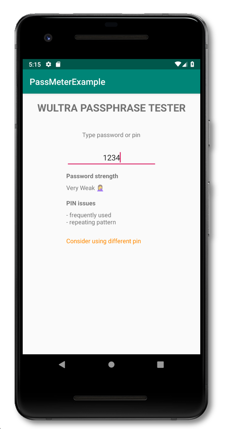

# Passphrase Meter for Android Apps

## Installation 

To get Wultra Passphrase Meter for Android up and running in your app, add following dependency in your `gradle.build` file:

```gradle
repositories {
    jcenter() // if not defined elsewhere...
}

dependencies {
    implementation "com.wultra.android.passphrasemeter:passphrasemeter-core:1.0.0"
}
```
Note that this documentation is using version `1.0.0` as an example. You can find the latest version in our [List of Releases](https://github.com/wultra/passphrase-meter/releases). The Android Studio IDE can also find and offer updates for your application's dependencies.

To achieve more accurate password testing results, you can add a dependency to additional dictionaries, designed for particular regions:

| Additional dependency | Region or Language |
|----------------|--------------------|
| `implementation "com.wultra.android.passphrasemeter:passphrasemeter-dictionary-en:1.0.0"`   | For english speaking people |
| `implementation "com.wultra.android.passphrasemeter:passphrasemeter-dictionary-czsk:1.0.0"` | For people speaking in Czech or Slovak |


## Usage

Before you start using the library, you need to add several imports into your Kotlin source codes:

```kotlin
import com.wultra.android.passphrasemeter.*;
import com.wultra.android.passphrasemeter.exceptions.*;
```

### Password testing

In order to test the password strength, use following code:

```kotlin
// If your app has an additional dependency on english dictionary,  
// then you need to load that dictionary first.
PasswordTester.getInstance().loadDictionary(assets, "en.dct")
// Test the password
val result = PasswordTester.getInstance().testPassword("test")
```

You can evaluate any password. The result of such operation is a strength of the password with the following levels:

- **Very Weak**
- **Weak**
- **Moderate**
- **Good**
- **Strong**

The password testing takes several things into account (keyboard patterns, alphabetical order, repetition, etc...). You can also add a dictionary of well-known words to get rid of passwords that looks strong to algorithms but are actually very common spoken words, or very frequent passwords.

### Additional dictionaries

The password strength testing can be improved by loading an appropriate dictionary. Due to limitations in the underlying `zxcvbn-c` implementation, only one dictionary can be loaded in the memory at the same time. Fortunately, this technical limitation typically doesn't cause problems in real-world scenarios, because people typically speak in one primary language. So, we decided to prefer fewer changes in the low level "zxcvbn-c" implementation, over more developer-friendly API.

We recommend you to use dictionaries in the following manners:

1. Determine in which language your user speak
1. Load an appropriate dictionary with using `.loadDictionary()` function
1. Use the password testing functions
1. Release previously loaded resources:
   ```kotlin
   PasswordTester.getInstance().freeLoadedDictionary()
   ```

If you do not free the loaded dictionary, then the allocated resources will be released in the next `.loadDictionary()` call.


### PIN testing

The PIN testing is slightly different to password testing, because the result of such test is a list of findings. Look for this example:

```kotlin
try {
    val passcode = "1456"
    val result = PasswordTester.getInstance().testPin(passcode)
    if (result.isEmpty()) {
        // No issues were found. 
        // Note that this is typically very strict evaluation, so please read the rest
        // of this chapter. 
    }
} catch (e: WrongPinException) {
    // PIN format error
}
```

You can evaluate any PIN. The result of the testing is a collection of issues that were found in PIN. This issues can be:

- **Not Unique** - the passcode doesn't have enough unique digits.
- **Repeating Digits** - there is a significant amount of repeating digits in the passcode.
- **Has Pattern** - repeating pattern was found in the passcode - 1357 for example.
- **Possibly Date** - this passcode can be a date and possibly birthday of the user.
- **Frequently Used** - the passcode is in list of most used passcodes.
- **Wrong Input** - wrong input - the passcode must contain digits only.

Note that you should implement your own additional logic, based on the sensitivity of the data you're protecting with the passcode and on other security measures. Here's an example how such evaluation may look like:

```kotlin
try {
    val passcode = "1456"
    val result = PasswordTester.getInstance().testPin(passcode)
    
    // We want different classification for different pin length
    // to not eliminate too much pins (too keep good pins around 95%)
    
    var warnUser = false
    if (pin.length == 4) {
        warnUser = result.contains(PinTestResult.FREQUENTLY_USED) || 
                   result.contains(PinTestResult.NOT_UNIQUE)
    } else if (pin.length <= 6) {
        warnUser = result.contains(PinTestResult.FREQUENTLY_USED) || 
                   result.contains(PinTestResult.NOT_UNIQUE) || 
                   result.contains(PinTestResult.REPEATING_CHARACTERS)
    } else {
        warnUser = result.contains(PinTestResult.FREQUENTLY_USED) || 
                   result.contains(PinTestResult.NOT_UNIQUE) || 
                   result.contains(PinTestResult.REPEATING_CHARACTERS) || 
                   result.contains(PinTestResult.HAS_PATTERN)
    }

} catch (e: WrongPinException) {
    // PIN format error
}
```

### Example project

The repository contains a simple example application, showing usage of the library:

1. Import `Source/examples/Android/PassMeterExample` folder in Android Studio
1. Build and run an example application

If everything works fine, then you can test your passwords in the simulator (or on a real device):



---

## Contact

If you need any assistance, do not hesitate to drop us a line at [hello@wultra.com](mailto:hello@wultra.com) or our official [gitter.im/wultra](https://gitter.im/wultra) channel.

### Security Disclosure

If you believe you have identified a security vulnerability with Wultra Passphrase Meter, you should report it as soon as possible via email to [support@wultra.com](mailto:support@wultra.com). Please do not post it to a public issue tracker.