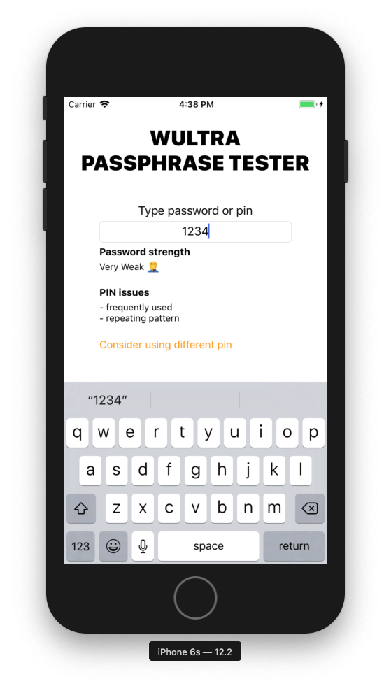

# Passphrase Meter for iOS Apps

## Installation 

This chapter describes how to get Wultra Passphrase Meter for iOS up and running in your app. In the current version, we support integration via __Swift Package Manager__ and __CocoaPods__.

### Swift Package Manager

Add `https://github.com/wultra/passphrase-meter` repository as a package in Xcode UI and add `WultraPassphraseMeter` and `WultraPassphraseMeterCore` libraries as a dependency.

<!-- begin box info -->
You can add `WultraPassphraseMeter*LANGUAGENAME*Dictionary` packages for better language support.
<!-- end -->

Alternatively, you can add the dependency manually. For example:

```swift
// swift-tools-version:5.4

import PackageDescription

let package = Package(
    name: "YourLibrary",
    platforms: [
        .iOS(.v11)
    ],
    products: [
        .library(
            name: "YourLibrary",
            targets: ["YourLibrary"]),
    ],
    dependencies: [
        .package(name: "WultraPassphraseMeter", url: "https://github.com/wultra/passphrase-meter.git", .from("1.1.0")),
        .package(name: "WultraPassphraseMeterCore", url: "https://github.com/wultra/passphrase-meter.git", .from("1.1.0")),
        .package(name: "WultraPassphraseMeterENDictionary", url: "https://github.com/wultra/passphrase-meter.git", .from("1.1.0")),
        .package(name: "WultraPassphraseMeterCZSKDictionary", url: "https://github.com/wultra/passphrase-meter.git", .from("1.1.0")),
        .package(name: "WultraPassphraseMeterRODictionary", url: "https://github.com/wultra/passphrase-meter.git", .from("1.1.0")),
    ],
    targets: [
        .target(
            name: "YourLibrary",
            dependencies: ["WultraPassphraseMeter", "WultraPassphraseMeterCore", "WultraPassphraseMeterENDictionary", "WultraPassphraseMeterCZSKDictionary", "WultraPassphraseMeterRODictionary"])
    ]
)
```

### CocoaPods

[CocoaPods](http://cocoapods.org) is a dependency manager for Cocoa projects. You can install it with the following command:
```bash
$ gem install cocoapods
```

To integrate PowerAuth library into your Xcode project using CocoaPods, specify it in your `Podfile`:
```ruby
target '<Your Target App>' do
  pod 'WultraPassphraseMeter'
end
```

To achieve more accurate password testing results, you can add a dependency to additional dictionaries, designed for particular regions:

| Additional pod | Region or Language |
|----------------|--------------------|
| `pod 'WultraPassphraseMeter/Dictionary_en'`   | For English speaking people |
| `pod 'WultraPassphraseMeter/Dictionary_czsk'` | For people speaking in Czech or Slovak |
| `pod 'WultraPassphraseMeter/Dictionary_ro'`   | For Romanian speaking people |


Then, run the following command:
```bash
$ pod install
```

### macOS

Note that we don't develop applications for macOS, so we cannot provide support for this platform, but as you can see, the library's "podspec" definition doesn't limit its use for iOS only. So, you can use it also for your macOS projects. We'll be happy to hear about your experience with such projects.

## Usage

Before you start using the library, you need to add the following import into your swift source codes:

```swift
import WultraPassphraseMeter
// You need to import each additional dictionary manually
// when using Swift Package Manager. 
// This is not needed for CocoaPods integration.
// import WultraPassphraseMeterENDictionary
```

### Password testing

In order to test the password strength, use the following code:

```swift
// If your app has an additional dependency on the english dictionary,  
// then you need to load that dictionary first.
PasswordTester.shared.loadDictionary(.en)
// Test the password
let strength = PasswordTester.shared.testPassword("test")
print(strength)
```

You can evaluate any password. The result of such operation is a strength of the password with the following levels:

- **Very Weak**
- **Weak**
- **Moderate**
- **Good**
- **Strong**

Password testing takes several things into account (keyboard patterns, alphabetical order, repetition, etc...). You can also add a dictionary of well-known words to get rid of passwords that looks strong to algorithms but are actually very common spoken words, or very frequent passwords.

### Additional dictionaries

The password strength testing can be improved by loading an appropriate dictionary. Due to limitations in the underlying `zxcvbn-c` implementation, only one dictionary can be loaded in the memory at the same time. Fortunately, this technical limitation typically doesn't cause problems in real-world scenarios, because people typically speak in one primary language. So, we decided to prefer fewer changes in the low-level "zxcvbn-c" implementation, over a more developer-friendly API.

We recommend you to use dictionaries in the following manners:

1. Determine in which language your user speak
1. Load an appropriate dictionary with using `.loadDictionary()` function
1. Use the password testing functions
1. Release previously loaded resources:
   ```swift
   PasswordTester.shared.freeLoadedDictionary()
   ```

If you do not free the loaded dictionary, then the allocated resources will be released in the next `.loadDictionary()` call.


### PIN testing

The PIN testing is slightly different to password testing, because the result of such test is a list of findings. Look for this example:

```swift
let passcode = "1456"
let result = PasswordTester.shared.testPin(passcode)
if result.issues.isEmpty {
    // No issues were found. 
    // Note that this is typically very strict evaluation.
}

if result.shouldWarnUserAboutWeakPin {
	// Warn the user that the PIN is weak.
	// Be aware that this property is just a hint based on simple rules. 
	// Consider implementing your own logic based on the `issues` property.
}
```

The result of the testing is a collection of issues that were found in a PIN. These issues can be:

- **Not Unique** - the passcode doesn't have enough unique digits.
- **Repeating Digits** - there is a significant amount of repeating digits in the passcode.
- **Has Pattern** - repeating pattern was found in the passcode - 1357 for example.
- **Possibly Date** - this passcode can be a date and possibly the birthday of the user.
- **Frequently Used** - the passcode is in the list of most used passcodes.
- **Wrong Input** - wrong input - the passcode must contain digits only.

### Example project

The repository contains a simple example application, showing usage of the library:

1. Open `Source/examples/iOS/PassMeterExample` folder
1. Run `pod install` in the folder. This step is only required if the compilation fails at pod's project self-check.
1. Open `PassMeterExample.xcworkspace` Xcode workspace. 
1. Build and run an example application

If everything works fine, then you can test your passwords in the simulator (or on a real device):



### Integration with secure password objects

If your application is using a custom objects, such as `PowerAuthCorePassword` from [PowerAuth mobile SDK](https://github.com/wultra/powerauth-mobile-sdk) for keeping user's password securely in the memory, then you can easily test PIN or password without a leaking plaintext password in the memory. This is due to fact, that both `testPin()` and `testPassword()` functions accept `UnsafePointer<Int8>` at input. It's expected that you provide nul-terminated UTF8 encoded string to both functions to work correctly. If you provide a regular swift's string, then this is achieved by implicit conversion to such array of bytes by swift compiler.

The following example shows how to ingegrate this library with `PowerAuthCorePassword` object:
```swift
import PowerAuthCore

extension PowerAuthCorePassword {
    func testPin() -> PinTestResult {
        var result = PinTestResult(pinLength: 0, issues: .pinFormatError)
        _ = validateComplexity { ptr, _ in
            result = PasswordTester.shared.testPin(ptr)
            return 0
        }
        return result
    }
    
    func testPassword() -> PasswordStrength {
        var result = PasswordStrength.veryWeak
        _ = validateComplexity { ptr, _ in
            result = PasswordTester.shared.testPassword(ptr)
            return 0
        }
        return result
    }
}
```

## Contact

If you need any assistance, do not hesitate to drop us a line at [hello@wultra.com](mailto:hello@wultra.com) or our official [gitter.im/wultra](https://gitter.im/wultra) channel.

### Security Disclosure

If you believe you have identified a security vulnerability with Wultra Passphrase Meter, you should report it as soon as possible via email to [support@wultra.com](mailto:support@wultra.com). Please do not post it to a public issue tracker.
